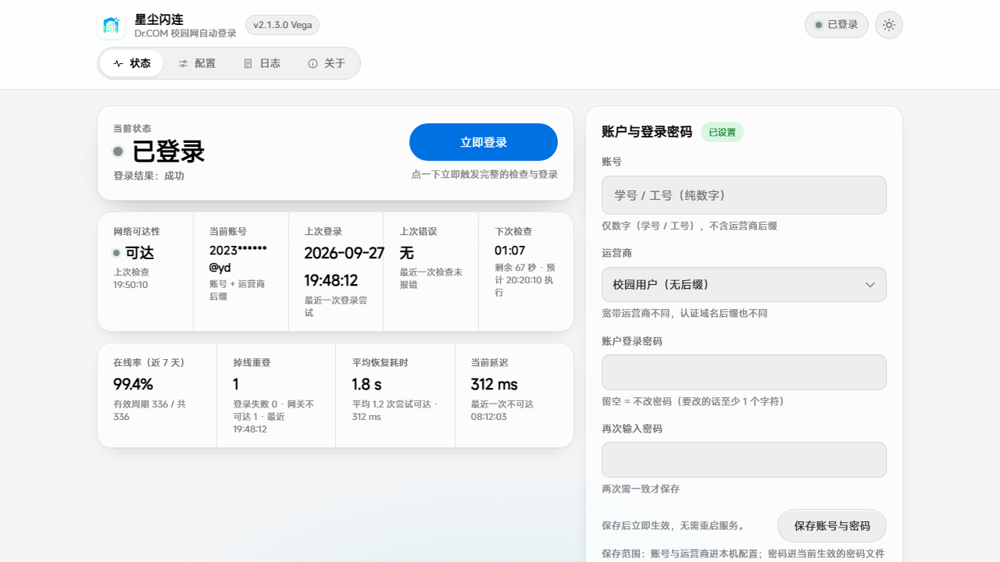
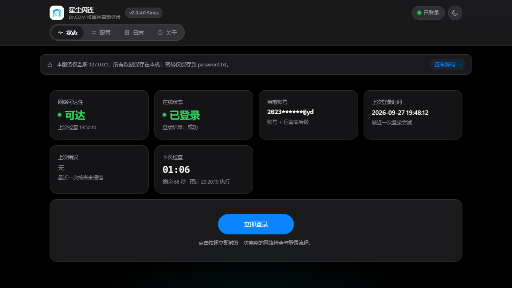

<p align="center">
  
</p>

<h1 align="center">星尘闪连</h1>

<p align="center">
  <b>Stardust Flash Link</b> · Windows 校园网自动登录
</p>

<p align="center">
  <a href="https://github.com/TSS-Small-sunshine/StardustFlashLink/releases/latest"></a>
  <a href="https://github.com/TSS-Small-sunshine/StardustFlashLink/blob/main/LICENSE"></a>
  <a href="https://github.com/TSS-Small-sunshine/StardustFlashLink/stargazers"></a>
  <a href="#快速开始"></a>
  <a href="#快速开始"></a>
</p>

<p align="center">
  Windows 校园网认证网关自动登录工具：开机自启 + 周期自检 + 智能离线识别 + Web UI 图形化配置。
</p>

## 📑 目录

- [⚠️ 适用范围声明](#适用范围声明请先读这里)
- [✨ 功能特性](#功能特性)
- [📸 截图](#截图)
- [🏷 项目状态](#项目状态)
- [🛠 技术栈](#技术栈)
- [🧩 架构说明](#架构说明)
- [🔐 认证协议](#认证协议)
- [📂 目录结构](#目录结构)
- [🚀 快速开始](#快速开始)
- [🤖 自动构建（GitHub Actions）](#自动构建github-actions)
- [🖥 Web UI 说明](#web-ui-说明)
- [⚙️ 配置文件说明](#配置文件说明)
- [❓ 常见问题](#常见问题)
- [🔒 安全说明](#安全说明)
- [⚖️ 免责声明](#免责声明)
- [📜 许可证](#许可证)
- [📚 文档索引](#文档索引)
- [📝 版本记录](#版本记录)

---

## ⚠️ 适用范围声明（请先读这里）

> **❗ 本项目全部实测验证均在「福建农业职业技术学院」校园网环境下完成。**
>
> 下面这些默认值都是**在该校环境实测**得出的，不是通用值：
>
> - 默认认证网关 `172.16.80.3`
> - 认证端口：`80`（在线状态探测） / `801`（登录提交）
> - 运营商账号后缀规则：不带后缀（校园网）/ `@yd`（移动）/ `@dx`（电信）/ `@lt`（联通）
> - 登录接口路径 `/eportal/portal/login`、在线查询接口路径 `/drcom/chkstatus`
>
> **其它学校的网关地址、端口、接口路径、参数规则大概率不一样。**
> 换学校请自行抓包 / 查认证页面源码确认后修改 `config.json`，**本项目不保证可用**。
> 若接口路径不同，还需要修改 `联网_service.py` 中的接口地址。

---

## 功能特性

- **开机自动登录**：以 Windows 系统服务（NSSM）托管，系统启动时自动触发一次认证
- **Web UI 配置界面**：浏览器打开 `http://127.0.0.1:8848`，不用改源码、不用记配置项就能改账号 / 密码 / 间隔
- **周期自检 + 智能离线识别**：定时检测在线状态；不在校园网时静默跳过，失败后指数退避 `5 → 10 → 20 → 40 → 60` 分钟封顶
- **网络位置守卫**（v2.0.5.0，默认关闭）：配好 Wi-Fi 名 / 网段白名单后，只在校园网里才执行检查 —— 带回家、连热点、挂 VPN 不再白跑
- **托盘图标 + 断线通知**（v2.0.6.0）：通知区小图标，掉线 / 恢复 / 服务未响应时弹气泡；右键可「打开配置页 / 立即登录 / 打开日志 / 退出」
- **密码与代码分离**：密码只存在 `password.txt` 中，源码内**零硬编码凭据**
- **零第三方 Python 依赖**：全部使用 Python 标准库，受限网络环境也能跑
- **一键安装 / 一键卸载**：`install.bat` / `uninstall.bat` 全程自动
- **可选打包安装程序**：用 Inno Setup 6 打成 `.exe` 安装向导（`packaging\build.bat`）

---

## 📸 截图

**Web UI 主界面（亮色）** — `http://127.0.0.1:8848`

<p align="center">
  
</p>

**Web UI 主界面（暗色）** — 右上角可一键切换，或跟随系统 `prefers-color-scheme`

<p align="center">
  
</p>

> **截图里的账号已脱敏**（渲染为 `2023******@yd`）：这两张图是用假数据渲染的界面预览，不含任何真实账号 / 密码。
> 重拍方式见 [`AGENTS.md`](AGENTS.md)「截图规范」——**禁止**用真机页面直接截图。

<!-- 待补：
<p align="center">
  
</p>
-->

---

## 🏷 项目状态

**当前版本**：`v2.0.9.0 "Sirius"`（天狼星，2026-09-28） · **状态**：🟢 积极维护

> 版本线（`MAJOR.MINOR`）都有代号，规则与候选表见 [`docs/VERSIONING.md`](docs/VERSIONING.md)。

[最新 Release](https://github.com/TSS-Small-sunshine/StardustFlashLink/releases/latest) ·
[更新日志](CHANGELOG.md) ·
[问题反馈](https://github.com/TSS-Small-sunshine/StardustFlashLink/issues)

---

## 🧱 模块划分

v2.0.2 起由单文件拆成 6 个纯标准库模块（**内嵌 Python 运行时下同样是这 6 个文件**），
v2.0.6.0 起另加一个**用户会话**里的托盘小程序：

| 文件 | 职责 | 关键符号 |
| --- | --- | --- |
| `联网_service.py` | 入口 / 生命周期：路径与常量、配置读写与校验、密码读写、日志、状态与退避、NSSM 重启、`main()` | `DEFAULT_CONFIG`、`_load_config`、`_validate_config`、`_save_config`、`_load_password_from_disk`、`_get_password`、`_save_password_to_disk`、`STATE`、`BACKOFF`、`_startup_trigger`、`run_periodic`、`main` |
| `protocol.py` | 认证协议层：等网络 → 查在线 → 登录；网络发现 | `run_once`、`wait_network`、`is_online`、`login`、`discover_network` |
| `web_api.py` | HTTP 路由层：`/`（内联单页）、`/branding/*`、全部 `/api/*`、Host / Origin / 自定义头校验 | `_Handler`、`api_get_status`、`api_post_config`、`api_post_password`、`api_post_login`、`api_post_restart`、`api_get_log_tail`、`_HTML_PAGE` |
| `auto_update.py` | 自动升级：GitHub 探测、下载与 SHA256 校验、静默安装、升级熔断、启动钩子 | `_check_github_latest`、`_download_installer`、`_do_update_now`、`_auto_update_loop`、`_post_upgrade_startup`、`_ensure_nssm_appexit_sane` |
| `eula.py` | EULA 与 CHANGELOG 读取 | `api_get_changelog` |
| `version.py` | **版本号 + 代号唯一来源** | `VERSION`、`CODENAME`、`CODENAME_CN`、`VERSION_FULL` |
| `tray.py` | **托盘小程序**（v2.0.6.0）：随登录启动，轮询本机 `/api/status` 弹断线通知；`ctypes` 直调 Win32（`Shell_NotifyIcon`），无第三方依赖 | `classify`、`decide_events`、`status_text`、`TrayApp`、`--check`、`--self-test` |

> 依赖方向：`联网_service.py` → 其余 5 个模块；其余模块之间**不互相 import**（共享对象由 `_attach()` 注入）。
> `tray.py` 更独立：**不 import 任何业务模块**，只通过本机 HTTP 接口跟服务说话 ——
> 所以它跑在用户会话（非管理员）里也完全没问题。

---

## 技术栈

| 分类 | 技术 / 版本 | 说明 |
| --- | --- | --- |
| 运行环境 | Windows 10 / 11 x64（**安装包已内嵌 Python，无需预装**） | 安装包自带 CPython embeddable 运行时到 `python\`，目标机**不需要**任何 Python |
| 从源码运行 | **Python 3**（实测 3.14） | 仅「源码方式」（`install.bat` / 直接跑脚本）才需要自备 Python：需 `python.exe` 在 PATH 中，或装在 `C:\Python314\` |
| 依赖 | **Python 标准库，零第三方包** | `urllib` / `json` / `socket` / `http.server` / `threading` / `logging` |
| Web UI | `http.server`（stdlib）+ 内联 HTML / CSS / JS | 单文件内嵌页面，**无 CDN、无外部资源**，离线可用 |
| 服务托管 | **NSSM 2.24** | 由 `install.bat` 自动下载到 `tools\nssm.exe`，**不入库** |
| 打包（可选） | **Inno Setup 6** | `packaging\build.bat` 一键构建，产物在 `packaging\output\` |

> **不依赖**：Node.js、pip 包、外部数据库、任何在线 CDN。

---

## 架构说明

### 线程模型

```
Windows 服务（NSSM）启动
        │
        ├── 线程 A：startup-trigger  ── 等待 3 秒 ──► run_once("startup")
        ├── 线程 B：periodic-check   ── 按自检间隔 ─► run_once("periodic")
        └── 主线程：HTTP Server 监听 127.0.0.1:8848
                        ▲
                        └── 浏览器 Web UI / 手动「立即登录」 ──► run_once("manual")
```

### 一次检查的执行流程

```
run_once(原因)
   │
   ├─ 1. 读取 config.json（每次实时读，改配置无需重启）
   ├─ 2. wait_network：每 2 秒探测 网关:端口，最长 network_wait_timeout_sec 秒
   │         └─ 超时不可达 → 判定「不在校园网」→ 静默返回，不计失败
   ├─ 3. is_online：GET /drcom/chkstatus 查在线状态
   │         ├─ 已在线   → 重置退避，结束
   │         └─ 未在线   → 继续
   └─ 4. login：POST 账号+密码 到 /eportal/portal/login
             ├─ 成功 → 记录 last_login_at，重置退避
             └─ 失败 → 记录 ERROR，进入指数退避
```

### 状态与退避

| 项 | 说明 |
| --- | --- |
| 退避档位 | `5 → 10 → 20 → 40 → 60` 分钟（`BACKOFF_LEVELS`），60 分钟封顶 |
| 触发条件 | 登录失败、连续检测异常、**网关不可达**（视为「不在校园网」，同样计入退避） |
| 重置条件 | 检测到已在线 / 登录成功 |
| 实际等待 | 周期线程取 **`min(自检间隔, 剩余退避时间)`**：退避已到期 → 立即重试；退避小于间隔 → 按退避等待；退避大于间隔 → 仍按自检间隔（不会被退避无限推迟）。v2.0.2 之前误用 `max`，表现为开机后 30 分钟没有任何登录尝试 |
| 密码未设置 | 记 `last_error=密码未设置`，**不计入退避**（属于用户操作问题，不是网络问题） |

### 数据与持久化

| 内容 | 位置 | 说明 |
| --- | --- | --- |
| 配置 | `<脚本目录>\config.json` | 缺失时自动生成默认值；**升级 / 重装不会覆盖**（安装器 `onlyifdoesntexist`） |
| 密码 | `<脚本目录>\password.txt` | UTF-8 单行纯文本；除空行与安装包自带的模板提示行外，**整行都是密码原文（可以包含 `#`）** |
| 业务日志 | `<脚本目录>\logs\campus_login.log` | 认证过程日志，持续追加**不自动轮转**，可随时手动清理 |
| 升级日志 | `<脚本目录>\logs\upgrade.log` | 每次检查 / 下载 / 安装 / 熔断的流水；Web UI「查看升级历史」看的就是它 |
| 升级尝试记录 | `<脚本目录>\logs\update_attempt.json` | 记录"正在升到哪个版本 / 第几次尝试 / 是否生效"，失效的自动重试靠它熔断 |
| 静默安装日志 | `<脚本目录>\logs\installer-silent.log` | 自动升级时安装器的 `/LOG` 输出，排查"升级没装上"看这里 |
| 服务输出 | `<脚本目录>\logs\service_stdout.log` / `service_stderr.log` | NSSM 捕获的标准输出 / 错误，1 MB 轮转 |
| 品牌图片 | `<脚本目录>\branding\web-logo-*.png` | Web UI 顶栏 logo 与站点图标，由 `/branding/*` 只读路由提供 |

---

## 认证协议

> 以下接口为**福建农业职业技术学院**实测结果，其它学校请自行确认。

### ① 查询在线状态

```
GET http://{HOST}/drcom/chkstatus?callback=cb&jsVersion=4.X     （端口 80）
```

- 响应为 **JSONP**：`cb({"result":1,"uid":"...","AC":"...","oltime":N,...})`
- `result == 1` → **已在线**；`result == 0` → 未在线

### ② 提交登录

```
GET http://{HOST}:801/eportal/portal/login?callback=dr{随机数}&login_method=1
    &user_account={账号}{后缀}&user_password={密码}
    &wlan_user_ip=..&wlan_user_ipv6=&wlan_user_mac=..
    &wlan_ac_ip=..&wlan_ac_name=..
    &jsVersion=4.1.3&lang=zh-cn&v={随机数}
```

- 响应为 **JSONP**：`dr{随机数}({"result":1,"msg":"...","ret_code":0})`
- `result == 1` → **登录成功**；否则 `msg` 字段为失败原因

### ③ 参数取值优先级（踩过坑的地方）

登录表单里的 `wlan_user_ip` / `wlan_user_mac` / `wlan_ac_ip` / `wlan_ac_name` **不能乱填**，该校门户脚本 `a41.js` 使用如下降级链（依次尝试，取第一个可用值）：

| 参数 | 取值优先级 |
| --- | --- |
| `wlan_user_ip` | 认证页重定向 URL 的 `wlanuserip` → `chkstatus` 响应的 `v46ip` → `ss5` → `v4ip` → `hex16ToString(ss3)` → 本机网卡 IP |
| `wlan_user_mac` | 认证页重定向 URL 的 `mac` → `chkstatus` 响应的 `ss4` → `olmac` → 占位常量 `000000000000` |
| `wlan_ac_ip` / `wlan_ac_name` | 认证页重定向 URL 的 `wlanacip` / `wlancname` |

> **本 Windows 版当前实现的简化版**（`discover_network()`）：
> 从 `chkstatus` 响应取 `v4ip` 作 `wlan_user_ip`，取 `olmac` 作 `wlan_user_mac`（做去 `:` / `-` 并转大写），
> `v4ip` 缺失时回退到 UDP `connect` 探测出的本机网卡 IP；
> `wlan_ac_ip` / `wlan_ac_name` 目前**发送空字符串**（`""`），该校网关对此接受。
> 若你在其它学校环境遇到登录被拒，优先按上表补齐这些参数。

### ④ 关于「重定向」

未认证时，网关通常会**把普通 HTTP 请求 302 重定向到认证页**（认证页 URL 上会带 `wlanuserip` / `mac` / `wlanacip` 等查询参数）。
浏览器里看到的就是那个页面；本项目的做法是**直接按上面的接口规则发请求**，不解析重定向 HTML，因此更稳定、更快。

---

## 目录结构

```
DrcomAutoLogin-Windows/
├── 联网_service.py            # 入口：配置 / 密码 / 状态 / 退避 / 线程调度 / main()
├── protocol.py                # 认证协议：等网络 → 查在线 → 登录、网络发现
├── web_api.py                 # HTTP 路由 + 内联单页 Web UI（HTML/CSS/JS 全在 _HTML_PAGE）
├── auto_update.py             # 自动升级：探测 / 下载 / 校验 / 静默安装 / 熔断 / 启动钩子
├── eula.py                    # EULA 与 CHANGELOG 读取
├── version.py                 # 版本号 + 版本代号（唯一来源）
├── install.bat                # 一键安装：注册并启动 Windows 服务
├── uninstall.bat              # 一键卸载：停止并移除服务
├── README.md                  # 本文件
├── CHANGELOG.md               # 逐版本变更（README 只留摘要）
├── LICENSE                    # MIT 许可证
├── docs/
│   ├── VERSIONING.md          # 版本号规则 / 版本线代号表
│   ├── screenshot-webui.png       # Web UI 截图（亮色）
│   └── screenshot-webui-dark.png  # Web UI 截图（暗色）
├── AGENTS.md                  # AI / 协作者编辑规范（改代码前请读）
├── _smoke_static.py           # 静态冒烟测试（python _smoke_static.py）
├── _smoke_http.py             # HTTP 层冒烟测试（python _smoke_http.py）
├── .github/workflows/build-installer.yml  # 自动构建安装程序并发布 Release
└── packaging/                 # 【可选】打包成安装程序
    ├── build.bat              # 构建入口（双击运行）
    ├── build.ps1              # 构建逻辑（自动准备 NSSM / Inno Setup）
    ├── setup.iss              # Inno Setup 6 脚本
    ├── RELEASE-NOTES.md       # Release 说明模板（CI 渲染占位符）
    ├── LICENSE.txt            # 安装包内附的许可证
    ├── config.json.template   # 默认配置模板（安装时复制为 config.json，已存在则不覆盖）
    ├── password.txt.template  # 密码文件占位模板（内容为空）
    ├── branding/              # app.ico / EULA.rtf / web-logo-*.png / wizard-left-*.png / wizard-small-*.png
    └── README.md              # 打包与安装包使用说明
```

> 运行时才会生成、**不在仓库中**：`config.json`、`password.txt`、`logs\`、`tools\`（NSSM）、`python\`（CI 构建时下载的内嵌 Python 运行时，打进安装包）、`packaging\output\`。

---

## 快速开始

### 🎯 路径 0：直接下载安装程序（最省事，推荐）

打开 <https://github.com/TSS-Small-sunshine/StardustFlashLink/releases/tag/installer> → 下载 `StardustFlashLink-Setup-v*.exe` → 双击安装。

> 安装包**已内嵌 Python 运行时**，目标机无需预先安装 Python。

### 🪜 路径 A：一键安装（源码方式）

> 此方式需要本机已安装 Python 3（安装包方式不需要）。

1. **确认已安装 Python 3**（实测 3.14），命令行执行 `python --version` 能看到版本号
2. **以管理员身份**双击 `install.bat`（脚本会自动请求提权）
3. 脚本会自动完成：
   - 下载 NSSM 2.24 到 `tools\nssm.exe`（已存在则跳过）
   - 注册并启动 Windows 服务 `DrcomAutoLogin`
   - 在桌面和开始菜单创建「Dr.COM 配置」快捷方式
4. 打开浏览器访问 **`http://127.0.0.1:8848`**
5. 在「配置」标签页填入**账号**，选择**运营商后缀**，点「修改密码」设置密码，最后点「💾 保存配置」
6. 回到「状态」标签页点「🔄 立即登录」验证；成功后开机将自动登录

### 📦 路径 B：打包成安装程序（可选）

1. 安装 **Inno Setup 6**（`build.bat` 会检测，缺失时可自动下载安装）
2. 双击运行 `packaging\build.bat`（会自动准备 NSSM 并调用 `ISCC.exe` 编译）
3. 构建产物：`packaging\output\StardustFlashLink-Setup-v2.0.9.0.exe`
4. 把该 `.exe` 分发出去，双击即按向导安装（可勾选「创建桌面快捷方式」「安装后立即启动服务」）

---

## 自动构建（GitHub Actions）

推送代码到 `main` 后，GitHub Actions 会自动在 Windows runner 上用 Inno Setup 构建安装程序：

1. 打开 <https://github.com/TSS-Small-sunshine/StardustFlashLink/actions>
2. 构建完成后，产物在 `Actions → 对应 run → Artifacts → DrcomAutoLogin-Setup`

也可以直接从 Releases 下载（**每次推送自动覆盖更新，链接固定**）：

<https://github.com/TSS-Small-sunshine/StardustFlashLink/releases/tag/installer>

> CI 流程：安装 Inno Setup 6 → 准备中文语言文件 → 下载 NSSM 到 `tools\` → 下载并解压内嵌 Python 到 `python\` → 用 ISCC 编译 `packaging\setup.iss` → 校验产物 → 上传 artifact → 发布到 tag `installer` 的 Release。

### 分支与发布约定

| 约定 | 说明 |
| --- | --- |
| **每个版本一个分支** | 版本分支命名 `hotfix/v{版本}`（如 `hotfix/v2.0.2.4`）。本版全部改动只落在该分支上；**不要**把新版本的改动提交到旧版本分支 |
| 版本号单一来源 | `version.py` 的 `VERSION`；`packaging/setup.iss` 的 `MyAppVersion`、NSSM 服务描述、`install.bat` 描述、模块 docstring 必须同步 |
| 从版本分支发版 | 工作流的自动触发只监听 `main`/`master`，版本分支用 `workflow_dispatch` 手动触发：<br>`gh workflow run "Build Windows Installer" -R TSS-Small-sunshine/StardustFlashLink --ref hotfix/v2.0.2.4` |
| 一次构建出两条发布 | ① tag `installer`（**prerelease**，固定下载链接）；② tag `v{版本}`（**非 prerelease** —— `/releases/latest` 只认它，是自动升级通道） |
| 产物名固定 | `StardustFlashLink-Setup-v{版本}.exe`（不变量 I9，存量下载链接依赖它） |

> 自动升级客户端读 `/releases/latest` → 取 `tag_name` 与 asset 的 `digest`（sha256）→ **fail-closed** 校验通过才执行安装器。
> 因此每次发版都必须有非 prerelease 的 `v{版本}` release，否则升级链路拿不到版本号与校验值。

---

## Web UI 说明

浏览器打开 `http://127.0.0.1:8848`，共 4 个标签页：

| 标签 | 用途 |
| --- | --- |
| 📊 **状态** | 查看「网关是否可达 / 是否在线 / 上次登录时间与结果 / 下次检查倒计时」；提供「🔄 立即登录」手动触发一次认证 |
| ⚙️ **配置** | 修改守护网关、账号、运营商后缀、自检开关与间隔、网络等待超时、UI 端口；点「💾 保存配置」立即生效（UI 端口需重启服务）。另有「修改密码」按钮单独改密码 |
| 📝 **日志** | 实时查看 `campus_login.log` 尾部，支持关键字过滤、自动滚动、下载完整日志 |
| ℹ️ **关于** | 显示程序版本、服务启动时间与运行时长、配置 / 密码 / 日志文件位置；提供「🔁 重启服务」与「🗑 卸载服务」提示 |

---

## 配置文件说明

`config.json`（与 `联网_service.py` 同目录；缺失或损坏时自动生成默认值）：

| 字段 | 类型 | 默认值 | 说明 |
| --- | --- | --- | --- |
| `host` | 字符串 | `"172.16.80.3"` | 认证网关地址（**换学校必须改**） |
| `port` | 整数 | `80` | 在线状态探测端口，取值范围 `1-65535` |
| `account` | 字符串 | `""` | 校园网账号（**纯数字**，不含运营商后缀） |
| `suffix` | 字符串 | `""` | 运营商后缀，只能是 `""` / `"@yd"` / `"@dx"` / `"@lt"` |
| `auto_check_enabled` | 布尔 | `true` | 是否启用周期自检 |
| `auto_check_interval_min` | 整数 | `30` | 自检间隔（分钟），只能是 `5` / `15` / `30` / `60` / `120` |
| `network_wait_timeout_sec` | 整数 | `60` | 每次检查前等待网关可达的最长秒数，取值范围 `10-300` |
| `ui_port` | 整数 | `8848` | Web UI 监听端口，取值范围 `1024-65535`（**修改后需重启服务**） |

> 以上字段在保存时都会经过校验，非法值会被拒绝并给出提示。

---

## 常见问题

**Q1：服务起不来 / 装了但没反应？**
看 `logs\service_stderr.log`。**使用安装包版本时不会出现该问题**（安装包已内嵌 Python 运行时，目标机无需预装 Python）。若用源码方式：最常见原因是 Python 不在 PATH，命令行执行 `python --version` 验证，或把 Python 装到 `C:\Python314\`。装完可用管理员运行 `tools\nssm.exe restart DrcomAutoLogin`。

**Q2：日志一直显示「网关不可达」？**
说明当前不在校园网内，或被分到了别的网段。确认已连上校园网 Wi-Fi / 网线，并核对 `config.json` 的 `host` 是否为所在学校的网关地址（本项目默认值是**福建农业职业技术学院**的 `172.16.80.3`）。

**Q3：提示登录失败？**
依次检查：账号是否为纯数字（后缀单独在 `suffix` 里选）；密码是否正确；运营商后缀是否选对（移动 `@yd` / 电信 `@dx` / 联通 `@lt`，校内网选空）；最后看 `logs\campus_login.log` 里的 `ERROR` 行，失败原因会写在接口返回的 `msg` 里。

**Q4：Web UI 打不开（`http://127.0.0.1:8848`）？**
先确认服务在运行（`tools\nssm.exe status DrcomAutoLogin`）。若 `8848` 被别的程序占用，改 `config.json` 的 `ui_port` 或卸载重装后改端口，然后**重启服务**。注意 Web UI 只监听本机，手机等其它设备访问不了。

**Q5：怎么改密码？**
Web UI →「配置」标签页 → 点「修改密码」→ 输入新密码保存。也可直接编辑 `password.txt`（UTF-8 单行，前后不要空格）后重启服务。

**Q6：怎么卸载？**
- **脚本方式**：管理员运行 `uninstall.bat`。它会停止并移除 Windows 服务、删除桌面与开始菜单快捷方式；随后**询问**是否一并删除 `config.json`、`password.txt` 与 `logs\`（**默认保留**，直接回车即保留）。注意 `tools\`（NSSM）不会被自动删除，需要彻底清理可手动删掉整个目录。
- **安装包方式**：走「控制面板 → 程序和功能」卸载，或开始菜单里的卸载入口。它会停止并移除服务，并清理 `logs\` 与 `tools\`，但**保留** `config.json` 与 `password.txt`。

---

## 安全说明

- **密码只在 `password.txt`**：UTF-8 编码的单行纯文本文件，与其它配置分离；源码中**没有任何硬编码凭据**
- **凭据不入库**：`password.txt` 与 `config.json` 均已写入 `.gitignore`，不会被提交到仓库
- **需自行创建 `password.txt`**：本仓库不含该文件，请在使用前于脚本目录下自行创建并写入密码
- **Web UI 只监听 `127.0.0.1`**：不对局域网 / 外网开放，其它设备无法访问
- **接口不返回密码**：状态接口只返回 `password_status`（`set` / `missing`），永不返回密码原文
- **日志脱敏**：密码不写入任何日志文件；`config.json` 也不保存密码
- **权限建议**：`password.txt` 所在目录建议只授予本机账户访问权限（服务以系统账户运行，注意共享机器的风险）
- **提交前的自动隐私守卫**：`python _smoke_static.py` 会把本机 `password.txt` / `config.json` 里的账号拿去和**所有入库文件**比对，命中即测试失败。想连安装目录一起查，先设 `$env:DRCOM_DATA_DIR = 'D:\Program Files\DrcomAutoLogin'`（CI 上没有这些文件，该项自动跳过）；`logs\*`、`update_attempt.json`、`installer-silent.log`、`config-export-*.zip` 等运行期产物全部在 `.gitignore` 内
- **截图必须脱敏**：README 截图由 `_ui_redesign/preview.py` 的假数据渲染（账号打码成 `2023******`），**禁止**提交真机界面截图 —— 规则见 [`AGENTS.md`](AGENTS.md)

---

## 免责声明

本项目**仅供个人学习研究，以及为本人自有账号提供正常上网认证便利**。使用时请遵守所在学校的网络管理规定与相关法律法规；请勿用于批量爆破、代他人认证、绕过计费或任何破坏校园网秩序的行为。因使用本项目产生的一切后果由使用者自行承担。

---

## 📜 许可证

本项目以 **MIT 许可证**开源 — 详见 [LICENSE](LICENSE) 文件。

附加：安装包内置了 [用户协议 (EULA)](packaging/branding/EULA.rtf)，安装时会要求勾选同意。

---

## 文档索引

| 文档 | 内容 |
| --- | --- |
| 本 `README.md` | 功能、架构、协议、快速开始、常见问题 |
| [`packaging/README.md`](packaging/README.md) | 开发者构建安装包的步骤、安装 / 卸载流程、安装包目录结构、已知限制 |

---

## 版本记录

> 这里只留**版本线**（`MAJOR.MINOR`）级别的摘要，逐版本、逐条目的完整变更见 [`CHANGELOG.md`](CHANGELOG.md)。
> 版本线代号的命名规则与候选表见 [`docs/VERSIONING.md`](docs/VERSIONING.md)。

| 版本线 | 代号 | 摘要 |
| --- | --- | --- |
| **v1.0 – v1.4.0** | — | 功能成型期：NSSM 服务托管、Web UI 配置、周期自检与指数退避、一键安装 / 卸载、可选 Inno Setup 打包、内嵌 Python 运行时、GitHub Actions 自动构建、静默自动升级、配置导入导出、日志分级，并重命名为「星尘闪连」。 |
| **v2.0.0 – v2.0.3.0** | — | 2.0 时代：品牌视觉（Blue Archive 渐变 + `app.ico` / `wizard.bmp`）与 EULA；随后是稳定性与安全加固（4 个 `NameError` 升级按钮、SHA256 校验 fail-closed、Host / Origin / 自定义头校验、`password.txt` 模板行）；v2.0.3.0 把 Web UI 整体重做为 Apple 风格亚克力玻璃界面，并修掉 logo / favicon 404。 |
| **v2.0.9.0（当前）** | `Sirius` 天狼星 | 新增**配置方案**（B5）：教室 / 宿舍 / 家里各存一套「位置相关设置」（网关 / 检查间隔 / 守卫白名单），一键切换；填了 Wi-Fi 名的方案可在打开总开关后**按 SSID 自动切**（默认关，免得手动选择被系统改掉）。方案**只装位置相关字段**（账号密码与升级设置不进方案），切换是**先全量校验再原子写盘**，坏方案永远上不了线。新增 `profiles.py` + 5 个 `/api/profiles*` 端点 + 配置页卡片。 |
| v2.0.8.1 | `Sirius` 天狼星 | 🔴 **紧急修复**：升级时安装器可能**中途回滚**，把安装弄成「一半新一半旧」（真机实测 2.0.7.1→2.0.8.0：托盘进程锁着 `python\libcrypto-3.dll` → Inno 静默模式 Abort → 回滚删掉了新模块，服务 `import` 崩、Web UI 端口消失 ✗）。修法：**装前先请走托盘**（`stop-tray.ps1`，按「tray.py + 安装目录」精确匹配 ✓）+ **服务侧可选模块降级**（`import metrics` 失败只丢面板、服务照常 ✓）。另加**打包完整性守卫**：服务 import 的本地模块与 `setup.iss` 清单逐一比对，漏一个 CI 就红 ✓。 |
| v2.0.8.0 | `Sirius` 天狼星 | 新增**连接质量面板**（B4）：状态页给出近 7 天的在线率 / 掉线重登次数 / 平均恢复耗时 / 当前延迟 + 一张纯 CSS 柱状图。数据**全部从已有的 `logs/campus_login.log` 现算**（不落第二份状态文件 → 重启不清零、升级不丢），新增 `metrics.py` 与 `GET /api/metrics?days=N`，接口优雅降级（模块未注入 / 日志被删都只回空指标，绝不 500）。 |
| v2.0.7.1 | `Sirius` 天狼星 | 修**升级后托盘还在跑旧代码**：安装器确实又拉了一次托盘，但老实例握着单实例互斥体 → 新实例启动即秒退，于是「文件已换、代码没换」且完全静默（v2.0.7.0 的唤醒/换网重连就这样白装了 ✗）。现在托盘每 10 秒顺手比一次自己脚本的 `(mtime, size)` 指纹，一变就**先放手互斥体 → 起新进程 → 自己退出**；起不来则把互斥体拿回来继续跑（只记一行日志）。 |
| v2.0.7.0 | `Sirius` 天狼星 | 新增**事件驱动立即重连**（B3）：换网 / 睡醒后以前最多要等一个检查周期（默认 30 分钟）才补上登录 ✗。现在托盘当事件源 —— 监听 `WM_POWERBROADCAST`（睡醒后延 4 秒，等网卡连上）与 `NotifyAddrChange`（插网线 / 换 Wi-Fi / DHCP 换地址，立刻），一到就 `POST /api/login`；5 秒去抖防连打，监听线程出问题只退化成原来的 10 秒轮询。 |
| v2.0.6.3 | `Sirius` 天狼星 | 修**升级接口「假成功」**：先点「立即检查更新」、紧接着点「立即升级」时，第二个请求会被升级锁挡掉，但接口一律先回「已提交」✗ —— 用户以为点了没反应。现在两个入口**先探锁再回车**：忙就回 409 + 当前进度（「任务进行中（检查 GitHub 最新版本...），请稍候再试」）且不白启后台线程，空闲才回「已提交」并真的开跑。 |
| v2.0.6.2 | `Sirius` 天狼星 | 修**自动升级上来的用户托盘不自启**：从 2.0.4.4 升到 2.0.6.1 后 `HKLM\...\Run` 的启动项没落地 —— 根因是"新任务没法靠旧版本传"（旧版执行器只会传 `/TASKS=desktopicon,startservice`，Inno 就把新加的 `trayicon` 当成未选中 ✗）。改由**服务启动时对齐**：安装器把「是否自启」写进 `HKLM\SOFTWARE\DrcomAutoLogin\TrayAutostart`，服务每次启动据此建/修/删 `Run` 项 —— 任何升级路径都能自愈。 |
| v2.0.6.1 | `Sirius` 天狼星 | 修 B2 的自启漏洞：托盘启动项原挂 `HKCU`，而自动升级以 SYSTEM 身份运行安装器 → 会写进 SYSTEM 的配置单元 ✗。改挂 `HKLM`；另加「安装目录里 `tray.py` 连续两次不在 → 托盘自行退出」，避免卸载后留孤儿图标。 |
| v2.0.6.0 | `Sirius` 天狼星 | 新增**托盘小程序 + 断线通知**（B2）：服务跑在 session 0 弹不出通知，所以加了个随登录启动的用户会话小程序 `tray.py`（纯标准库 ctypes 直调 `Shell_NotifyIcon`，无第三方依赖），每 10 秒轮询本机 `/api/status`，掉线 / 恢复 / 服务未响应时弹气泡，右键菜单可「打开配置页 / 立即登录 / 打开日志 / 退出」。安装向导新增「开机自动启动托盘」任务；**真机自检通过**（`tray.py --self-test` 的 `NIM_ADD` 被通知区接受）。 |
| v2.0.5.0 | `Sirius` 天狼星 | 新增**网络位置守卫**：可配置 Wi-Fi 名（SSID）白名单与网段（CIDR）白名单，只有命中时才执行登录检查 —— 笔记本带回家 / 连热点不再白跑认证请求；默认关闭（`network_guard_enabled`），读不到 Wi-Fi 名时 fail-open 放行。配置页新增开关 + 两个输入框，状态页副标题显示当前 Wi-Fi。接口向后兼容（`PATCH` +1）。 |
| v2.0.4.5 | `Sirius` 天狼星 | 技术债收口：`protocol.run_once` 改**非阻塞抢锁**（原先"先持锁再判忙"是死逻辑 → 连点「立即登录」会排队跑 N 次）；`config.json` / `password.txt` 写盘改用**带 pid 的唯一 tmp 名**；安装器弃用的 `IsTaskSelected` → `WizardIsTaskSelected`；新增 **PR 检查闸门**（语法 + 两个冒烟，不发布）。 |
| v2.0.4.4 | `Sirius` 天狼星 | 安装向导收口：向导图改**多尺寸 PNG**（大图 5 档 202×386 → 430×824、小图 5 档 58×58 → 124×124，Inno 6 按 DPI 自动挑）、暗色向导 + `WizardSizePercent=110`、补回欢迎页；删掉过期的单张 `wizard.bmp`。 |
| v2.0.4.3 | `Sirius` 天狼星 | 收掉自动升级的两处尾巴：`winreg` 键路径误带 `HKLM\` 前缀（`AppExit` 自愈一直误报、策略其实正确）；升级执行器的结果归档时序（服务被安装器提前拉起时别删还在跑的执行器，并把安装日志归档回 `{app}\logs`）。 |
| v2.0.4.2 | `Sirius` 天狼星 | 修**自动升级装不上**：installer 改由「任务计划程序」拉起（直启会被 nssm 的 Job Object 连坐杀掉，真机实测装不上且服务停在 `StopPending`）；升级执行器带**看门狗**（失败也把服务拉回来）、落盘 installer 退出码与日志；`AppExit` 改按 nssm 真实结构读写；升级成功只认版本号。 |
| v2.0.4.1 | `Sirius` 天狼星 | 修 `PWD_LOCK` 自锁死锁（`GET /api/config` 永久挂起 → 配置页打不开、保存卡死、自动登录停摆）；安装器外观收口：桌面 / 开始菜单 / 「应用和功能」卸载项图标改用品牌 `app.ico`，`app.ico` 随包分发到 `{app}\branding`。 |
| v2.0.4.0 | `Sirius` 天狼星 | 修「自动升级反复重装却始终装不上」的整套死循环：启动钩子终于生效、`AppExit` 空值自愈、失败熔断（3 次 / 6 小时冷却）、静默安装不再弹窗挂起、`/VERYSILENT` + `/LOG`；修「`#` 开头的密码被当成注释整行吃掉」；「查看更新日志」随包分发，缺失时给中文提示与仓库链接。 |
| 后续版本线 | 见候选表 | 代号按 `MAJOR.MINOR` 走，候选星名表见 [`docs/VERSIONING.md`](docs/VERSIONING.md)。 |

> **版本号唯一来源**： [`version.py`](version.py) 的 `VERSION` / `CODENAME` / `CODENAME_CN`。
> 安装包 `MyAppVersion`、NSSM 服务描述、`install.bat` / `uninstall.bat` 标题、`packaging/build.ps1` banner
> 全部与它保持一致，`_smoke_static.py` 会把这些不一致直接判为失败。
